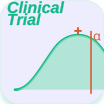

# Clinical Trial Sample Size & Power (ct-samplesize)

- **English guide** → [README.md](https://github.com/medstatstar/ct-samplesize/blob/main/README.md) · **中文指南** → [README_zh-CN.md](https://github.com/medstatstar/ct-samplesize/blob/main/README_zh-CN.md)

  

> **Easy-to-use Clinical Sample Size & Power Calculator for Clinical Researchers**
>
> You don't need to code or memorize commands — just describe your trial design in **plain language inside a chat**, and the skill performs **49** professional sample-size & power calculations for you. The default authoritative engine is a **remote coze R compute service** (rpact, TrialSize, PowerTOST and 20+ other packages running server-side, so your machine needs **no local R**; the published skill has **no local compute fallback**). Results come in Chinese or English per your OS setting (force-switchable via prompt). By default the skill shows a **SAFE PREVIEW** of the exact request it would send to coze — nothing leaves your machine until you confirm; full R code can be returned on request.

---

## Who This Is For

The `ct-*` clinical-trial skill family covers the whole clinical-trial lifecycle. ct-samplesize targets three groups who need **defensible sample-size / power numbers across 49 designs**:

- **Clinical-trial practitioners at pharmaceutical companies** — sponsors, CROs, and medical / statistical / regulatory roles: quick, auditable n / power for protocols, SAPs, feasibility.
- **Clinicians and nurses who design or run trials**: estimate sample size when drafting protocols or feasibility assessments.
- **Medical students who want to learn clinical-trial methodology**: exploring design families (group-sequential, adaptive, Bayesian, non-inferiority…).

This tool only takes aggregate design parameters — never patient-level data.

---

## 1. How to Use It in a Chat (the Core)

ct-samplesize is a **conversational skill**: you simply tell the assistant your trial design in natural language — no commands, no parameter names to remember. As a WorkBuddy skill it **auto-loads with no extra installation**.

Below are 6 real conversational examples ordered by common entry point — from "not sure which test" to specific designs. Each gives **"You say"** (a copy-ready natural-language input), a sketch of **"The assistant replies"**, plus how to get the actual number.

### Example 1 · Not sure which test (most common opening)
**You say:**
> I want a sample-size calculation but I'm not sure which test to use — help me figure it out

**Assistant replies (sketch):**
> Sure — let's pin down your trial design first. I'll ask 1–3 focused questions per round, each with a recommended default — confirm or adjust.
>
> **Round 1 (2 questions):**
> 1. What type is your **primary endpoint**? — continuous (e.g. BP difference) / binary (e.g. response rate) / time-to-event (e.g. OS) / other?
> 2. Is it **parallel-group** or **crossover/paired**? (most designs are parallel — default to that unless you say otherwise)
>
> *(You answer…)*
>
> **Round 2 (2 questions):**
> 3. What do you want to show — **superiority**, **non-inferiority**, or **equivalence**?
> 4. If the endpoint is binary/rate, the **effect expression** is the key fork: **absolute risk difference** (control 60% vs treatment 75%, a 15pp gap → `proportion_two`) or **OR / RR** as the primary effect (OR=2.0 → `odds_ratio`, RR=1.5 → `risk_ratio`)? The sample-size formulas differ substantially; an OR usually needs more subjects.
>
> *(Once the test and effect expression are locked, I'll echo a **needs portrait + recommended test + missing params** summary for your confirmation, then compute — no 49-test menu dumped on you in the meantime.)*

**📌 Note:** When you say "not sure which test", the assistant uses **branch-by-branch probing** to clarify your needs, instead of dumping the 49-test menu. Once clarified, it moves to computation.

### Example 2 · Two-means comparison (most common)
**You say:**
> Calculate sample size for two independent means, effect size d=0.5, power 80%, two-sided α=0.05

**Assistant replies (sketch):**
> Here is the sample-size calculation for a two-sample t-test (effect size d=0.5, power=0.8, two-sided α=0.05).
> You need about **64 per group** (128 total).
> Since this is a simple two-group solve, the assistant also auto-attaches a **sample-size curve** (n per group vs target power 0.6–0.95, SVG inline & editable); give a fixed n instead and you get the **power curve** (power vs n) automatically.
> (Safe preview by default: the exact coze request envelope is shown, nothing sent or computed — say "please compute directly" to actually run it.)

**📌 Get the actual number:** By default the skill shows a **SAFE PREVIEW** — the exact coze request envelope, nothing sent or computed. Say **"please compute directly"** and the assistant will really run it and give the number (on the default coze stateless engine this natural-language trigger is what fires the compute; **no `--yes` needed** — the legacy `--yes` flag applies only to the optional local-R dev backend, see Section 4, "Safe Preview").

### Example 3 · Two-group proportion
**You say:**
> Control response 20%, treatment 35%, two-group proportion chi-square, α=0.05 two-sided, power=0.8

**Assistant replies (sketch):**
> Two-group proportion comparison (control 20% vs treatment 35%, χ², α=0.05 two-sided, power=0.8): you need about **137 per group** (274 total). A **sample-size curve** is auto-attached; ask for a power-vs-n curve at any fixed n if needed.

**📌 Get the actual number:** By default the skill shows a **SAFE PREVIEW** — the exact coze request envelope, nothing sent or computed. Say **"please compute directly"** and the assistant will really run it and give the number (on the default coze stateless engine this natural-language trigger is what fires the compute; **no `--yes` needed**).

### Example 4 · Survival endpoint with interim
**You say:**
> Design a survival trial with 1 interim analysis, HR=0.75, 1:1 randomization, power 80%, and **plot the power curve** (n vs power)

**Assistant replies (sketch):**
> Parsed: time-to-event endpoint, HR=0.75, 1:1 randomization, power 80%, 1 interim analysis (group-sequential / interim framework by default).
> By default the skill shows a **SAFE PREVIEW** — the exact coze request envelope (test, params, mode) is displayed, nothing sent or computed.
> Say "please compute directly" to trigger the real calculation: it returns the required sample size (events d and total n) and auto-attaches your requested **power curve** (power vs n, SVG inline & editable).

**📌 Get the actual number:** SAFE PREVIEW by default (exact envelope shown, nothing sent or computed). Say "please compute directly" to really run it and get the number + curve inline (stateless remote engine, no `--yes` needed).

### Example 5 · Non-inferiority / Bioequivalence (curve mode)
**You say:**
> Non-inferiority design, margin=0.1, control rate 85%, treatment 80%, power 80%, and **draw the sample-size curve** (n vs target power)

**Assistant replies (sketch):**
> Parsed as non-inferiority (margin=0.1, control 85% vs treatment 80%, power 80%). By default SAFE PREVIEW; say "please compute directly" to get the per-group n and an auto-attached **sample-size curve** (n vs target power, SVG inline). Bioequivalence (BE) is the same pattern: theta0=0.95, CV=25%, 2×2 crossover also auto-attaches a sample-size curve.

**📌 Get the actual number:** SAFE PREVIEW by default (exact envelope shown, nothing sent or computed). Say "please compute directly" to run it and get the number + curve inline.

### Example 6 · Test selection / design-family choice (popup menu)
**You say:**
> Compare two antihypertensives on office systolic BP, parallel-group, power 90%. But I haven't decided superiority vs non-inferiority, and I'm not sure whether to add an interim analysis.

**Assistant replies (sketch):**
> The endpoint (continuous · office SBP) and design (parallel) are clear. Two choices remain — here's a menu to help you decide:
>
> **① What do you want to show?**
> - (a) Superiority: new drug lowers BP more than control → `ttest_ind` (superiority)
> - (b) Non-inferiority: not worse than control, margin up to you → `non_inferiority`
>
> **② Add an interim analysis?**
> - (a) No, fixed sample size → plain t-test
> - (b) Yes, 1–2 interims with early stopping → `group_sequential` family
>
> **③ Can't decide?** → Say "explain the differences between these choices in detail" and I'll clarify the clinical/statistical meaning before you choose.
>
> Pick your preferences for ①–②, or choose ③ to hear the explanation, and I'll lock the test and move to parameter completion / computation.

**📌 Note:** When you've **named the test type but are stuck on "which option / design family"** (e.g. superiority vs non-inferiority, with/without interim), the assistant **pops a routing menu** to confirm step by step — instead of deciding for you or dumping the full 49-test menu. The menu also offers an "explain the differences" option — when you're unsure, it explains before you decide. The full classification tree is in [`references/menu.md`](references/menu.md).

> 💡 **Tip:** Most tests need only three things — effect size (or rate / HR) + power + α. Anything you omit (e.g. two-sided α=0.05, 1:1 randomization, follow-up) is filled with sensible defaults. It's fine to be incomplete — the assistant will tell you what's missing.

---

## 2. What You Can Compute — 49 Test Scenarios

Tests are grouped by **endpoint type** (6 categories below). Each row gives the typical **clinical scenario** and a line you can **copy verbatim** under "Try saying". The same test may *also* be reached from a **design-family cross-index** (group-sequential, adaptive, equivalence / non-inferiority, Bayesian, dose-escalation, MAMS, historical control, vaccine, win-statistics …) — see [`references/menu.md`](references/menu.md).

> The underlying R engine runs **server-side on coze** (rpact / TrialSize / PowerTOST and 20+ other packages …); the published skill ships no R locally. See Section 5 "Advanced Reference" for the architecture note — ordinary users don't need to care.

### ① Continuous
| Test | Clinical Scenario | Try saying in chat |
|:---|:---|:---|
| `ttest_ind` | Two-means comparison (parallel) | "Two-group mean comparison, d=0.5, power 0.8" |
| `ttest_paired` | Paired t / 2×2 crossover | "Paired design sample size, effect 0.5" |
| `ttest_one` | One-sample vs known mean | "One-sample test, difference from known mean 0.5" |
| `anova` | Multi-group (k groups) | "3-group ANOVA, effect size f=0.25" |
| `equivalence` | Equivalence (means) | "Mean equivalence, margin=2, effect 1" |
| `mixed_model` | Repeated measures / longitudinal (power given n) | "Repeated-measures power, n=100, effect 0.5" |

### ② Binary / Proportions
| Test | Clinical Scenario | Try saying in chat |
|:---|:---|:---|
| `proportion_two` | Two-group rate (chi-square) | "Control 20% treatment 35%, two-group rate comparison" |
| `proportion_one` | Single-group rate | "Single-group rate test, expected 30%" |
| `proportion_paired` | Paired rate (McNemar) | "Paired rate comparison McNemar, p1=0.7 p2=0.5" |
| `odds_ratio` | Odds ratio | "Sample size for OR=2, control rate 50%" |
| `risk_ratio` | Risk ratio (RR) | "Sample size for RR=1.5, control rate 50%" |
| `non_inferiority` | Non-inferiority (rate) | "Non-inferiority, margin=0.1, control 85% treatment 80%" |
| `superiority_margin` | Superiority by margin | "Superiority test, margin 0.05" |
| `be_tost` | Bioequivalence (TOST) | "BE sample size, theta0=0.95, CV=25%" |
| `vaccine_efficacy` | Vaccine efficacy | "Vaccine efficacy, control VE=0.02 treatment 0.005" |
| `gsd_proportion` | Group-sequential two proportions | "Group-sequential two proportions, 1 interim, p1=0.7 p2=0.5" |

### ③ Count / Rates
| Test | Clinical Scenario | Try saying in chat |
|:---|:---|:---|
| `poisson` | Poisson rate | "Two-group rate comparison, λ1=0.05 λ2=0.03" |
| `recurrent_events` | Recurrent events (Andersen-Gill) | "Recurrent-event sample size, control rate 1.0" |
| `gsd_poisson` | Group-sequential Poisson | "Group-sequential Poisson rate" |

### ④ Survival / Time-to-event
| Test | Clinical Scenario | Try saying in chat |
|:---|:---|:---|
| `survival` | Survival (simplified logrank) | "Survival analysis, HR=0.75, power 0.85" |
| `survival_exact` | Survival (exact) | "Exact survival sample size, HR=0.75, accrual 12mo" |
| `ni_survival` | Non-inferiority survival | "Non-inferiority survival, HR margin=1.25" |
| `survival_equivalence` | Survival equivalence (TOST / log-HR) | "Survival equivalence, margin=1.25" |
| `survival_superiority` | Survival superiority w/ margin | "Survival superiority, margin 0.8" |
| `cox_covariate` | Cox regression w/ covariate R² | "Cox regression sample size, HR=2, R²=0.3" |
| `survival_one_sample` | One-sample exponential survival | "One-arm survival, median 12 vs 18" |
| `competing_risks` | Competing risks (cum. incidence) | "Competing-risk sample size, CIF 0.2 vs 0.1" |
| `survival_historical` | Historical-control logrank | "Historical-control survival, historical median 12 new 18" |
| `gsd_survival` | Group-sequential logrank | "Group-sequential survival, 1 interim, HR=0.7" |
| `gsd_hazard` | Group-sequential HR | "Group-sequential HR, HR=0.7" |
| `gsd_survival_sim` | Group-sequential logrank — Monte-Carlo | "Group-sequential survival simulation, 2 interims" |
| `gsd_hazard_sim` | Group-sequential HR — Monte-Carlo | "Group-sequential HR simulation" |

### ⑤ Diagnostic / Method comparison
| Test | Clinical Scenario | Try saying in chat |
|:---|:---|:---|
| `roc` | ROC curve / diagnostic trial | "ROC curve sample size, AUC 0.5→0.75" |
| `bland_altman` | Bland-Altman method comparison | "Bland-Altman sample size, SDdiff=5, margin 2.5" |

### ⑥ Special / Advanced designs
| Test | Clinical Scenario | Try saying in chat |
|:---|:---|:---|
| `group_sequential` | Group sequential / interim | "Group-sequential design, 2 interims, Pocock" |
| `adaptive` | Adaptive design | "Adaptive design, 2 stages" |
| `adaptive_simulate` | Adaptive design — Monte-Carlo | "Adaptive design Monte-Carlo simulation" |
| `bayesian` | Bayesian design | "Bayesian design, control 0.3 treatment 0.15" |
| `dose_escalation` | Dose escalation (Phase I) | "Phase I dose escalation, 5 doses, DLT 0.33" |
| `mams` | Multi-arm multi-stage (MAMS) | "MAMS, 3 arms 2 stages" |
| `dunnett` | Dunnett multiple comparison | "Dunnett, 3 groups control 50" |
| `win_ratio` | Win-Ratio composite endpoint | "Win-Ratio sample size, WR=1.5" |
| `must_win` | Must-Win / co-primary endpoints | "Co-primary endpoints 3, correlation 0.5" |
| `historical_controls` | Historical control borrowing | "Historical control borrowing, historical response 15/100" |
| `conditional_power` | Conditional power / SSR | "Conditional power, interim effect 0.2" |
| `assurance` | Bayesian assurance | "Assurance calculation" |
| `multiple_endpoints` | Multiple/compound endpoints | "Multiple-endpoint sample size, correlation 0.5" |
| `mediation` | Mediation effects | "Mediation sample size" |
| `cluster` | Cluster-randomized | "Cluster randomized, ICC=0.05, 30 per cluster" |

---

## 3. First-Time FAQ

**Q: I only gave effect size and power, no other parameters — will it still compute?**
A: Yes. Most tests need only three things — effect size (or rate / HR) + power + α. Omitted parts (two-sided α=0.05, 1:1 randomization, follow-up …) are filled with sensible defaults; if something truly required is missing, the assistant will ask.

**Q: Is the n in the result per group or total?**
A: By default it's **per group**; paired / crossover designs report per-sequence, and survival often reports total events needed. The output always labels this clearly, so no confusion.

**Q: It only shows code, not the number. How do I get the actual result?**
A: Just say **"please compute directly"** in the chat — the assistant will really run the compute and give you the number. (On the coze engine this natural-language trigger fires the compute, **no `--yes` needed**; the legacy `--yes` flag applies only to the optional local-R dev backend.) This is the default safe design: see the request envelope first, compute once you're sure.

**Q: I want the reproducible R code for submission or audit — how do I ask?**
A: Say **"give me the full R code"**. The code is also shown in safe preview by default, so you can copy, modify, and re-run it yourself.

**Q: On a Chinese system, is the output in Chinese?**
A: Yes. By default the output language follows your OS language setting — Chinese on a Chinese-OS, English otherwise. You can force-switch anytime via a prompt (e.g. "用中文回复" / "switch to English").

**Q: What if my data must stay confidential?**
A: Use the same design framework but **replace the raw data** (e.g. run through the flow with placeholder values), ask the skill to output the full R code, then run that code yourself locally with your real data — the skill only ever sends design parameters and never touches your raw data.

**Q: What if I found an error in the result — how do I report it?**
A: This skill follows the ct-base §20.3 bug-report workflow. If you suspect the result is wrong (or the engine errored), just say **"report a bug" / "上报问题" / "提交错误报告"**. The skill also **proactively asks** whether to report when it detects a likely defect (e.g. the engine errors or retries still fail) — at most **once per session**, and you can always decline. Either way, the assistant will:
1. **Propose a sanitized report** (11-field whitelist: skill / skill_version / test / error_type / error_code / engine_status / description / locale / query_origin / session_hash / attempts — **no raw input values or personal data**, except the `description` field where you decide what to disclose, e.g. the algorithm/function used and the error message);
2. **Show the full report text for your review** — you can add a problem description or correct anything before confirming;
3. **Send after your explicit confirmation** — to the unified endpoint `https://ct-bugreport.coze.site/run` (if this session called coze) or saved locally + emailed to the author (if purely local, data never leaves your machine);
4. **Receive an acknowledgment** — including whether a previously submitted report from your source has already been fixed (with the fix note) or is still pending.

You stay in full control: the report is shown to you **before** anything is sent, and nothing is transmitted without your explicit "send" confirmation.

---

## 4. Safety & Disclaimer

- **What is Safe Preview / coze compute:** The published skill **never runs R or a shell on your machine.** By default it calls the remote **coze** compute service (endpoint: `https://ct-samplesize.coze.site/run`) with only your trial-design parameters (never patient data). To inspect first, say **"preview only / --dry-run"** — it prints the exact request envelope and sends nothing. Say **"please compute"** to send and get the numbers + optional figures — on the coze stateless engine this natural-language trigger fires the compute, **no `--yes` needed** (the legacy `--yes` flag applies only to the optional local-R dev backend, not the published skill). Say **"show code / --show-code"** to see the coze request JSON (and the R source on request).
- **What leaves the machine (metadata disclosure):** each coze request carries (1) your trial-design parameters (test type, effect size, α, power, n …), (2) `locale` derived from your OS language (for bilingual output), and (3) a **hostname hash** `query_origin` (SHA-256 of your computer's hostname — not the hostname itself; used by the author only for server attribution / abuse rate-limiting). No patient data, file content, or personally identifiable information is sent.
- **Bug reports (optional, opt-in only):** if a likely skill defect is detected (e.g. engine error after retry), the assistant may ask whether to send a **sanitized** bug report to the author via the unified report endpoint (`https://ct-bugreport.coze.site/run`). It contains skill name/version/error type plus a **problem description you review and approve** — you may include the algorithm/function used, values and study design if needed; only identifiable person/institution/subject info is avoided. Nothing is sent without your confirmation; you can always decline, and in fully local sessions the report is saved as a file with the author's email instead.
- **coze-only (v5):** the published skill has **no local compute fallback** — if the cloud compute service (`https://ct-samplesize.coze.site/run`) is unreachable, the skill reports the configuration error and guides you to set `CTSS_COZE_ENDPOINT` (or `CTSS_COZE_MOCK=1` for a local demo). All 49 test types run server-side via coze.
- Outputs are for reference only; validate before regulatory submissions.

---

## 5. Advanced Reference (moved to a separate file)

CLI examples, bidirectional solving, curve mode, core formulas, system requirements, common errors, file structure, and references for developers have been moved to **[ADVANCED.md](docs/ADVANCED.md)**. Ordinary users don't need it; see Sections 1-4 for daily use.

---

**Version**: v5.1.0 | **License**: MIT | **Authors**: medstatstar, phoe-zip

For feature requests, bug reports, or other feedback, please contact the author directly at medstatstar@gmail.com (Wintone Zhang / 张文彤).

---

## Confidentiality Notice

> The CT series consists of 20+ specialized domain skills, organized into **two tiers — A, B** — by "whether the input contains confidential information" (network / egress / publish are independent orthogonal attributes; see ct-base §11), providing full coverage of the entire new-drug clinical trial (Clinical Trial) lifecycle.
>
> - **Tier A (non-confidential input)**: run fully locally using only ordinary data; Tier A may need external public retrieval but involves no confidential information. These skills are published openly on GitHub.
> - **Tier B (confidential input)**: accept strictly confidential clinical-trial data / protocols / CRFs from pharma sponsors (e.g., ct-analysis, ct-sdtm, ct-protocol, ct-eligibility); Tier B is processed locally and never leaves the boundary (egress=none), or additionally requires policy approval (egress=approval-req, e.g. ct-eligibility). Tier B packages contain zero confidential data but are NOT publicly published (stays fully local) — confidential input never ships with the package or leaves the machine. For custom / on-prem deployment, contact the author.
>
> 📧 Contact: medstatstar@gmail.com (Wintone Zhang / 张文彤)
